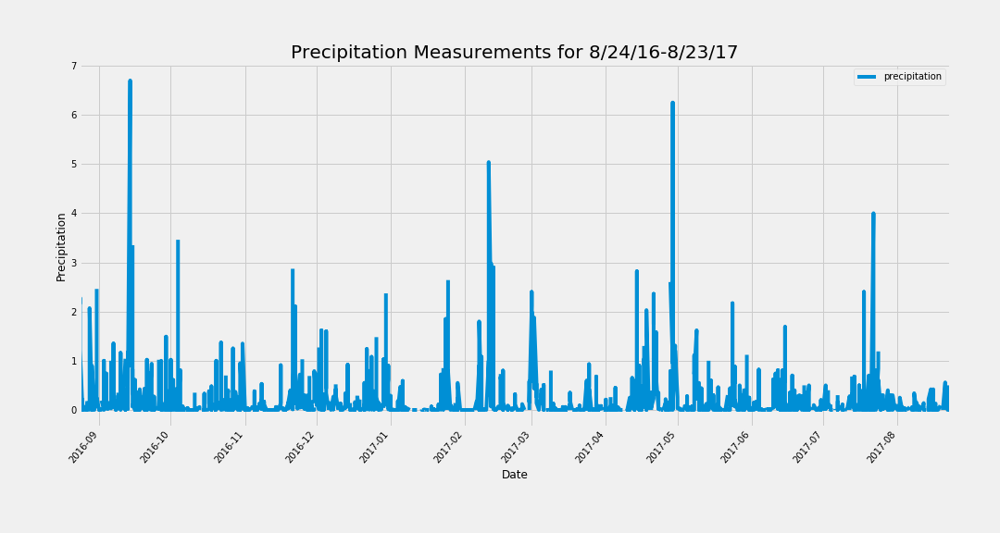
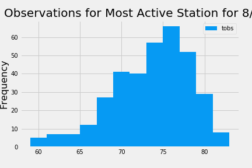
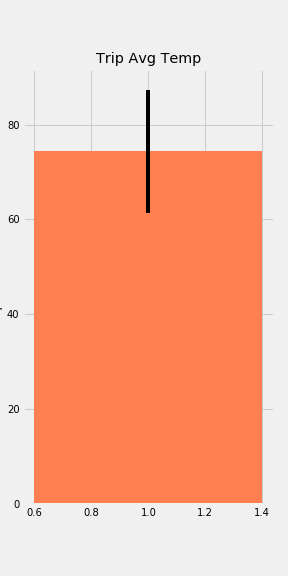

# SQLAlchemy Challenge - Surfs Up!

Perform climate analysis and then design a Flask API based on the queries 
that you have just developed.

## Questions
Historically what has weather been like in Hawaii for the dates you intend to 
take vacation there? Chosen vacation dates: 11/20/2019-11/29/2019

## Datasets
https://github.com/dmilestone/sqlalchemy-challenge/blob/master/Resources/hawaii.sqlite

## Breakdown of Tasks
### Part 1
1. Create engine using SQLAlchemy to read sqlite file with weather data.
2. Use automap_base() to map classes.
3. Create session to connect to sqlite.
4. Decide start date and end date for vacation and save them into variables.
5. Use pandas and SQLAlchemy to query weather data within that date range.
6. Write query to retrieve the last 12 months of precipitation data (only only the date and prcp values.).
7. Load the query results into a Pandas DataFrame and set the index to the date column.
8. Sort the DataFrame values by date.
9. Plot the results using matplotlib.pyplot.
10. Use Pandas to print the summary statistics for the precipitation data.
11. Design SQL query to calculate the total number of stations.
12. Design SQL query to find the most active stations.
13. List the stations and observation counts in descending order.
14. Use func.max to find out which station has the highest number of observations. 
15. Design a query to retrieve the last 12 months of temperature observation data (tobs).
16. Filter by the station with the highest number of observations.
17. Plot the results as a histogram with bins=12.

### Part 2
1. Design a Flask API based on the queries that you have just developed.
2. Create Routes:
  a. '/api/v1.0/precipitation'- Convert the query results to a Dictionary using date as the key and prcp as the value.
  b. '/api/v1.0/v1.0/stations' - Return a JSON list of stations from the dataset.
  c. '/api/v1.0/tobs' - Query for the dates and temperature observations from a year from the last data point.
Return a JSON list of Temperature Observations (tobs) for the previous year.
  d. '/api/v1.0/<start>' and '/api/v1.0/<start>/<end>' - Return a JSON list of the minimum temperature, the average temperature, and the max temperature for a given start or start-end range.

## Output/Conclusion

1. Bar chart showing the last 12 months of particiaption data

2. Histogram showing observables from most active stations - The most active station is WAIHEE 837.5, HI US with 2772 records.

3. Bar chart for average temperature in Hawaii over my designated vacation dates. Used the peak-to-peak (tmax-tmin) value as the y error bar (yerr).
The average temperature over my chosen dates is 74 degress farenheit with the historical low at 67 degrees and historical high at 80 degrees.
###

## Disclaimer
Thisproject was published for educational purposes only. 
Copyright
Trilogy Education Services © 2019. All Rights Reserved.
